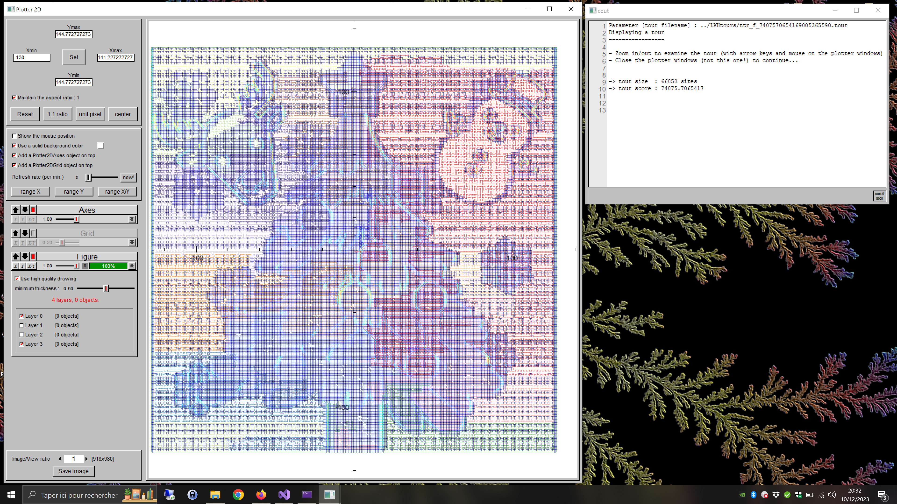

# Santa-Kaggle-2022

Code used for [Kaggle's 2022 Santa challenge](https://www.kaggle.com/competitions/santa-2022)

Here is the programm used to lift a LKH tour (computed with the `sqrt(L1) + color` norm) onto the arm configuration space.   

Details of how the program work can be found here: [https://www.kaggle.com/competitions/santa-2022/discussion/379086](https://www.kaggle.com/competitions/santa-2022/discussion/379086)

**Remarks**

- Use CMake to build the projet: requires my [mtools library](https://github.com/vindar/mtools)
- Tested only on Windows/VS2022

  

